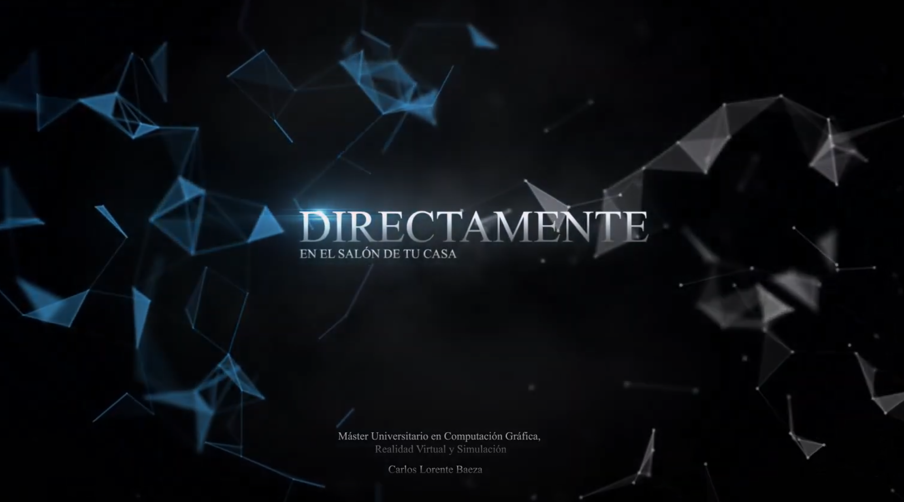
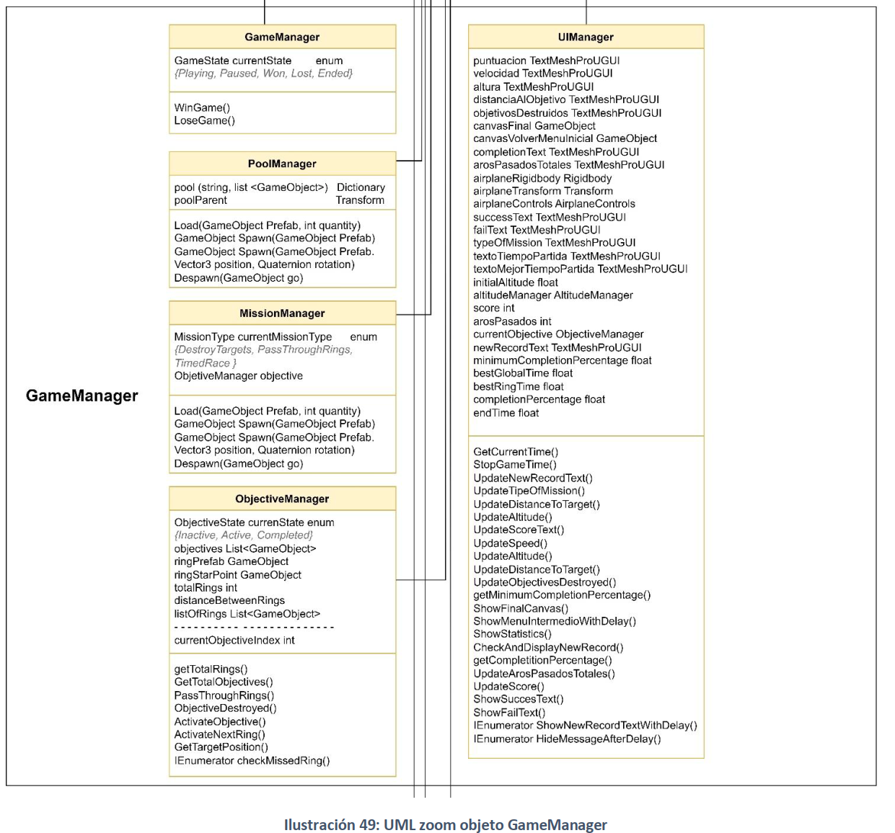
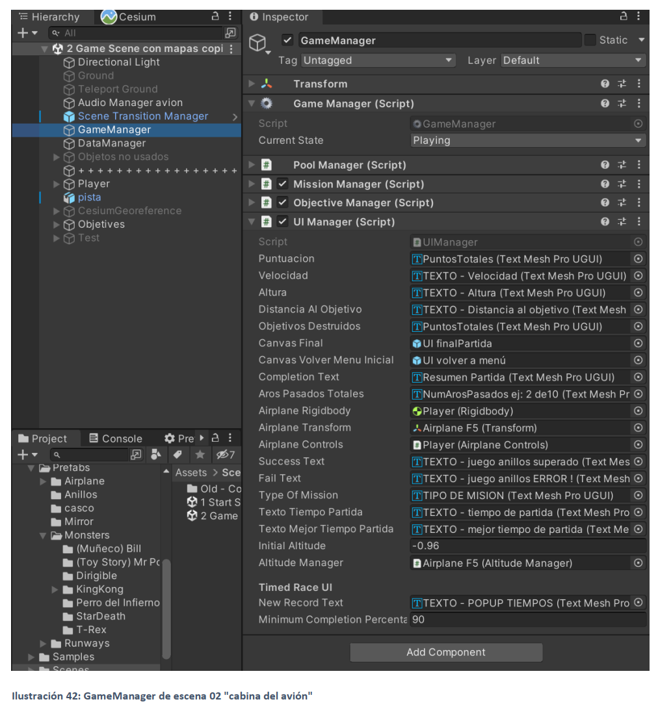
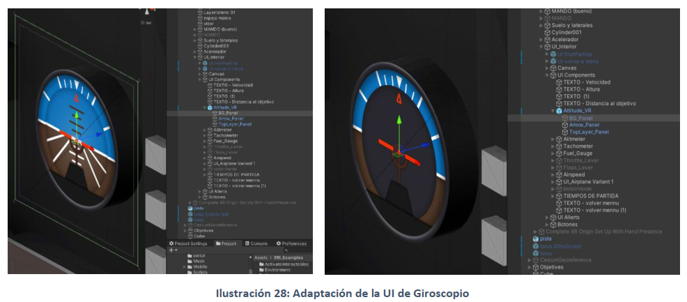
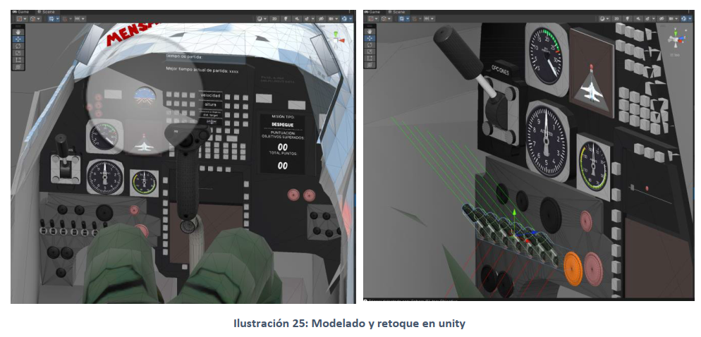

# Flight Simulator VR - Simulador de vuelo basado en realidad virtual

[](https://www.youtube.com/watch?v=RnSyyRkkCCA)

<div align="center">

*<sub>Haga clic en la imagen para abrir el video en YouTube</sub>*

</div> 

## 📋 Descripción del Proyecto

Este proyecto forma parte del **Trabajo de Fin de Máster (TFM)** de la Universidad UTAD. Se trata de una **aplicación formativa para pilotos basada en realidad virtual** que simula el vuelo de un avión F5 en un entorno inmersivo.

### 🎯 Objetivos
- Desarrollar una herramienta de formación para pilotos utilizando tecnologías de realidad virtual
- Crear una experiencia inmersiva que mejore la conciencia situacional y el control de vuelo
- Implementar un sistema de misiones y objetivos para el entrenamiento estructurado

## ✨ Características Principales

- **Simulación de vuelo en realidad virtual** con física realista
- **Integración con Cesium** para entornos geográficos realistas
- **Modelado 3D detallado** de la cabina del F5
- **Sistema de misiones** (Destruir objetivos, Pasar por anillos, Carrera cronometrada)
- **Audio espacial 3D** para mayor inmersión
- **Instrumentos de vuelo** interactivos (altímetro, velocímetro, tacómetro, etc.)
- **Sistema de puntuación** y mejores tiempos
- **Persistencia de datos** entre sesiones

## 🛠️ Requisitos del Sistema

### Software
- **Unity 2021.3.16f1** (LTS)
- **XR Interaction Toolkit 2.3.2**
- **TextMesh Pro**
- **Cesium for Unity** (opcional, para entornos realistas)
- **OpenXR Plugin**

### Hardware
- **Dispositivo VR compatible** (Oculus/Meta Quest, HTC Vive, etc.)
- **PC con especificaciones VR** (GPU compatible con VR)

## 📁 Estructura del Proyecto

```
📁 TFM_Utad/
├── 📁 Assets/
│   ├── 📁 Scripts/
│   │   ├── 📁 Airplane/                    # Sistema de avión
│   │   │   ├── 📄 AirplanePhysics.cs       # Física del avión
│   │   │   ├── 📄 AirplaneControls.cs      # Controles VR
│   │   │   ├── 📄 AirplaneCharacteristics.cs # Parámetros del avión
│   │   │   ├── 📄 AltitudeManager.cs       # Gestión de altitud
│   │   │   ├── 📄 LeverAcceleration.cs     # Aceleración de palancas
│   │   │   ├── 📄 VRJoystickController.cs  # Control VR del joystick
│   │   │   └── 📁 Instruments/              # Instrumentos de vuelo
│   │   │       ├── 📄 Airplane_Attitude.cs
│   │   │       ├── 📄 Airplane_Tachometer.cs
│   │   │       ├── 📄 AttitudeUIUpdater.cs
│   │   │       ├── 📄 IAirplaneUI.cs
│   │   │       ├── 📄 IP_Airplane_Airspeed.cs
│   │   │       ├── 📄 IP_Airplane_Altimeter.cs
│   │   │       ├── 📄 IP_Airplane_Engine.cs
│   │   │       ├── 📄 IP_Airplane_FlapLever.cs
│   │   │       ├── 📄 IP_Airplane_Fuel.cs
│   │   │       ├── 📄 IP_Airplane_FuelGauge.cs
│   │   │       ├── 📄 IP_Airplane_Propeller.cs
│   │   │       ├── 📄 IP_Airplane_ThrottleLever.cs
│   │   │       └── 📄 SpeedUIUpdater.cs
│   │   ├── 📁 BehaviourManagers/            # Gestores principales
│   │   │   ├── 📄 GameManager.cs           # Gestión de estados del juego
│   │   │   ├── 📄 MissionManager.cs        # Gestión de misiones
│   │   │   ├── 📄 ObjectiveManager.cs      # Gestión de objetivos
│   │   │   ├── 📄 UIManager.cs             # Gestión de interfaz
│   │   │   ├── 📄 DataManager.cs           # Persistencia de datos
│   │   │   ├── 📄 PoolManager.cs          # Sistema de pooling
│   │   │   ├── 📄 AudioManager.cs         # Gestión de audio
│   │   │   ├── 📄 PhysicsManager.cs       # Gestión de física
│   │   │   └── 📄 SceneTransitionManager.cs # Transiciones de escena
│   │   ├── 📁 UI/                          # Interfaz de usuario
│   │   │   ├── 📄 UIManager.cs
│   │   │   ├── 📄 InfoPanel.cs
│   │   │   ├── 📄 MinimapLine.cs
│   │   │   ├── 📄 ButtonInteraction.cs
│   │   │   ├── 📄 FadeScreen.cs
│   │   │   ├── 📄 GameStartMenu.cs
│   │   │   ├── 📄 PlayerCollider.cs
│   │   │   ├── 📄 SetOptionFromUI.cs
│   │   │   ├── 📄 SetTurnTypeFromPlayerPref.cs
│   │   │   ├── 📄 ShootingScript.cs
│   │   │   ├── 📄 ShowCanvas.cs
│   │   │   └── 📄 UIAudio.cs
│   │   ├── 📁 Utils/                       # Utilidades
│   │   │   ├── 📄 Singleton.cs
│   │   │   ├── 📄 MoveForward.cs
│   │   │   └── 📄 DespawnAfterTimeElapsed.cs
│   │   
│   ├── 📁 Scenes/                          # Escenas del juego
│   │   ├── 🎬 1 Start Scene.unity         # Escena de inicio/lobby
│   │   ├── 🎬 2 Game Scene con mapas copiaSeg.unity # Escena de vuelo
│   │   └── 📁 Old - Copias/               # Escenas de respaldo
│   ├── 📁 Prefabs/                         # Prefabs del juego
│   ├── 📁 Materials/                       # Materiales 3D
│   ├── 📁 Textures/                        # Texturas
│   ├── 📁 Audio/                           # Archivos de audio
│   │   ├── 📁 Airplanes/                   # Sonidos de aviones
│   │   ├── 📁 Airport/                     # Sonidos de aeropuerto
│   │   ├── 📁 Background/                  # Música de fondo
│   │   ├── 📁 Cabina/                      # Sonidos de cabina
│   │   ├── 📁 Menus/                       # Sonidos de menús
│   │   ├── 📁 VFX/                         # Efectos de sonido
│   │   └── 📁 Kenney Audio/               # Pack de audio Kenney
│   ├── 📁 CesiumSettings/                  # Configuración de Cesium
│   │   └── 📁 Resources/
│   │       └── ⚙️ CesiumRuntimeSettings.asset
│   ├── 📁 XR/                             # Configuración XR
│   ├── 📁 XRI/                            # XR Interaction Toolkit
│   ├── 📁 XRI_Examples/                   # Ejemplos XR
│   ├── 📁 Fonts/                          # Fuentes del proyecto
│   ├── 📁 Plugins/                        # Plugins de Unity
│   ├── 📁 Settings/                       # Configuraciones URP
│   └── 📁 Video/                          # Archivos de video
├── 📁 ProjectSettings/                     # Configuración del proyecto Unity
├── 📁 Packages/                           # Dependencias del proyecto
├── 📁 .img/                              # Diagramas y documentación
│   ├── 🖼️ GameManager.png                 # Diagrama UML del GameManager
│   ├── 🖼️ gameManager_avion.png          # Diagrama del GameManager del avión
│   ├── 🖼️ modelado.png                    # Proceso de modelado 3D
│   ├── 🖼️ modelado2.png                  # Proceso de modelado 3D (parte 2)
│   └── 🖼️ UI giroscopio..png              # Interfaz de instrumentos
├── 📄 .gitignore                          # Archivos ignorados por Git
├── 📄 README.md                           # Este archivo
└── 📄 LICENSE                             # Licencia del proyecto
```

## 🥽 Implementación de Realidad Virtual

### Tecnologías VR Utilizadas

- **XR Interaction Toolkit 2.3.2** - Framework principal para interacciones VR
- **OpenXR Plugin** - Estándar abierto para compatibilidad multiplataforma
- **Universal Render Pipeline (URP)** - Renderizado optimizado para VR
- **SteamVR** - Soporte para dispositivos HTC Vive y compatibles
- **Oculus Integration** - Soporte nativo para dispositivos Meta/Oculus

### Hardware VR Soportado

- **Meta Quest 2/Pro** - Dispositivos principales de desarrollo
- **HTC Vive/Vive Pro** - Compatibilidad completa
- **Valve Index** - Soporte experimental
- **Pico 4** - Compatibilidad básica

### Implementación de Controles VR

#### 🎮 Sistema de Interacción
```csharp
// Ejemplo de implementación de controles VR
public class VRJoystickController : MonoBehaviour
{
    [SerializeField] private XRBaseInteractable joystick;
    [SerializeField] private Transform airplane;
    
    private void Update()
    {
        // Captura de movimiento del joystick VR
        Vector3 joystickInput = joystick.transform.localRotation.eulerAngles;
        ApplyAirplaneControls(joystickInput);
    }
}
```

#### 🖐️ Gestos y Manipulación
- **Grab Interactables** - Agarre de controles de cabina
- **Socket Interactors** - Conexión de elementos (palancas, botones)
- **Direct Interactors** - Manipulación directa con manos VR
- **Ray Interactors** - Interacción a distancia con puntero láser

### Sistema de Movimiento VR

#### 🚶‍♂️ Locomoción
- **Teleportación** - Movimiento instantáneo por puntos
- **Smooth Locomotion** - Movimiento continuo con joystick
- **Room Scale** - Movimiento físico en el espacio real
- **Comfort Settings** - Configuraciones anti-mareo

#### 🎯 Tracking de Manos
```csharp
// Sistema de tracking de manos VR
public class HandTracking : MonoBehaviour
{
    [SerializeField] private XRHand hand;
    [SerializeField] private Transform airplaneControls;
    
    private void Update()
    {
        // Detección de gestos para controles
        if (hand.isTracked)
        {
            ProcessHandGestures();
        }
    }
}
```

### Optimizaciones VR

#### ⚡ Rendimiento
- **90 FPS mínimo** - Frame rate estable para evitar mareo
- **Foveated Rendering** - Renderizado adaptativo por fijación visual
- **Dynamic Resolution** - Ajuste automático de resolución
- **Occlusion Culling** - Culling optimizado para VR

#### 🎨 Calidad Visual
- **Single Pass Instanced Rendering** - Renderizado eficiente para ambos ojos
- **Spatial Audio** - Audio 3D posicional
- **Post-Processing VR** - Efectos visuales optimizados
- **LOD System** - Niveles de detalle adaptativos

### Configuración VR por Dispositivo

#### 📱 Meta Quest 2/Pro
```csharp
// Configuración específica para Quest
[XRConfigurationData]
public class QuestSettings : ScriptableObject
{
    [Header("Quest Specific Settings")]
    public float renderScale = 1.2f;
    public bool handTrackingEnabled = true;
    public bool passthroughEnabled = false;
}
```

#### 🖥️ PC VR (Vive, Index)
```csharp
// Configuración para PC VR
[XRConfigurationData]
public class PCVRSettings : ScriptableObject
{
    [Header("PC VR Settings")]
    public float renderScale = 1.0f;
    public bool advancedTracking = true;
    public bool fingerTracking = true;
}
```

### Experiencia de Usuario VR

#### 🎯 Diseño de Interfaz
- **UI World Space** - Interfaces flotantes en el espacio 3D
- **Hand Menu** - Menús accesibles con gestos de mano
- **Gaze Cursor** - Cursor que sigue la mirada
- **Haptic Feedback** - Retroalimentación táctil

#### 🛡️ Comfort y Seguridad
- **Guardian System** - Límites de espacio de juego
- **Comfort Vignette** - Efecto de túnel durante movimiento
- **Height Adjustment** - Ajuste automático de altura
- **Seated/Standing Modes** - Modos de juego adaptativos

### Testing y Debugging VR

#### 🔧 Herramientas de Desarrollo
- **XR Device Simulator** - Simulador de dispositivos VR en editor
- **VR Debug Console** - Consola de debug específica para VR
- **Performance Profiler** - Análisis de rendimiento VR
- **Comfort Metrics** - Métricas de comodidad del usuario

#### 🧪 Testing sin Hardware
```csharp
// Sistema de testing sin VR hardware
public class VRTestingMode : MonoBehaviour
{
    [SerializeField] private bool useKeyboardControls = true;
    
    private void Update()
    {
        if (useKeyboardControls)
        {
            // Controles de teclado para testing
            ProcessKeyboardInput();
        }
    }
}
```

## 🏗️ Arquitectura del Código

El proyecto está basado en el **patrón Singleton** con múltiples Managers que coordinan diferentes aspectos del juego:

### GameManager
Controla los estados principales del juego:
- **Estados**: `Playing`, `Paused`, `Won`, `Lost`, `Ended`
- **Métodos principales**:
  - `StartGame()` - Inicia el juego
  - `PauseGame()` - Pausa el juego
  - `WinGame()` - Finaliza con victoria
  - `LoseGame()` - Finaliza con derrota

<div align="center">



*Diagrama UML completo del GameManager*

</div>

<div align="center">



*Configuración específica del GameManager para el sistema de avión*

</div>

### MissionManager
Gestiona los tipos de misión disponibles:
- **Tipos de misión**: `DestroyTargets`, `PassThroughRings`, `TimedRace`
- **Métodos principales**:
  - `Load()` - Carga la misión
  - `Spawn()` - Genera objetivos
  - `Despawn()` - Elimina objetivos

### ObjectiveManager
Controla los objetivos individuales:
- **Estados**: `Inactive`, `Active`, `Completed`
- **Métodos principales**:
  - `PassThroughRings()` - Pasar por anillos
  - `ObjectiveDestroyed()` - Objetivo destruido
  - `ActivateNextRing()` - Activar siguiente anillo

### UIManager
Actualiza todos los elementos de interfaz en tiempo real:
- **Información mostrada**: Puntuación, velocidad, altitud, distancia a objetivos
- **Métodos principales**:
  - `GetCurrentTime()` - Obtener tiempo actual
  - `StopGameTime()` - Detener cronómetro
  - `ShowFinalCanvas()` - Mostrar pantalla final
  - `UpdateScore()` - Actualizar puntuación

### Sistema de Avión
- **AirplanePhysics**: Física y fuerzas aerodinámicas
- **AirplaneControls**: Input de controles VR
- **AirplaneCharacteristics**: Parámetros del avión
- **Instrumentos**: Altímetro, velocímetro, tacómetro, combustible, etc.

<div align="center">



*Interfaz de instrumentos de vuelo - Giroscopio y otros instrumentos de cabina*

</div>

### Diagrama UML
Ver `.img/GameManager.png` para las relaciones completas entre clases.

## 🚀 Instalación y Configuración

### 1. Clonar el repositorio
```bash
git clone https://github.com/tu-usuario/TFM_Utad.git
cd TFM_Utad
```

### 2. Abrir en Unity
1. Abrir **Unity Hub**
2. Añadir proyecto existente
3. Seleccionar la carpeta `TFM_Utad`
4. Asegurarse de usar **Unity 2021.3.16f1**

### 3. Configurar XR (Opcional)
1. Ir a **Window > XR Plugin Management**
2. Instalar **OpenXR Plugin**
3. Configurar para tu dispositivo VR

### 4. Configurar Cesium (Opcional)
1. Ir a **Window > Cesium**
2. Configurar token de Cesium Ion (opcional)
3. Seleccionar ubicación geográfica

### 5. Ejecutar el proyecto
1. Abrir la escena `1 Start Scene`
2. Presionar **Play** en Unity
3. Conectar dispositivo VR

## 🎮 Controles

### Controles VR
- **Movimiento**: Controles de mano VR
- **Interacción**: Botones y palancas de la cabina
- **Teleportación**: Sistema de movimiento VR

### Controles de Prueba (Teclado)
Para pruebas sin hardware VR:
- **AD / Flechas horizontales**: Movimiento horizontal
- **WS / Flechas verticales**: Movimiento vertical
- **Espacio**: Disparo de ráfaga
- **B**: Disparo de misil
- **M**: Acelerar
- **N**: Reducir velocidad

## 📊 Persistencia de Datos

El proyecto utiliza **PlayerPrefs** para almacenar datos persistentes:
- **Tipo de misión seleccionada**
- **Mejor tiempo por misión**
- **Configuraciones del usuario**

Los datos se guardan automáticamente al cerrar la aplicación.

## 🛠️ Herramientas de Desarrollo

### Software Utilizado
- **Unity 2021.3.16f1** - Motor de juego
- **3D Studio Max** - Modelado 3D
- **AutoCAD** - Diseño técnico
- **Photoshop** - Texturas y UI
- **After Effects** - Efectos visuales

### Librerías y Plugins
- **XR Interaction Toolkit** - Interacción VR
- **Cesium for Unity** - Entornos geográficos
- **TextMesh Pro** - Texto de alta calidad
- **Universal Render Pipeline** - Renderizado

## 📈 Proceso de Desarrollo

### 1. Modelado 3D
- Modelado de la cabina del F5 en **3D Studio Max**
- Texturizado con **Photoshop**
- Importación a Unity como prefabs

<div align="center">


*Proceso de modelado de la cabina del F5 en 3D Studio Max*

</div>

<div align="center">



*Refinamiento y detalle del modelado en Unity*

</div>

### 2. Programación
- Implementación de la física del avión
- Sistema de misiones y objetivos
- Interfaz de usuario y HUD

### 3. Integración VR
- Configuración de XR Interaction Toolkit
- Implementación de controles VR
- Optimización para dispositivos VR

### Modo de Prueba
- Controles de teclado para pruebas sin VR
- Sistema de debug en tiempo real
- Logs detallados del comportamiento del avión

## 📄 Licencia

Este proyecto está bajo la **Unity Companion License** para proyectos dependientes de Unity.

## 👥 Créditos

- **Desarrollador**: Txarlye (cítame o invítame a un café)
- **cafe**: bc1qh3z7yd2gv6m64dkwnnukn40aafhhmyht72aklf
- **Universidad**: U-TAD
- **Tutor**: David Pinto
- **Año**: 2023

### Recursos Externos
- **Modelos 3D**: Recursos gratuitos de Unity Asset Store
- **Audio**: Kenney Audio Pack
- **Texturas**: Texturas personalizadas y de dominio público

## 📞 Contacto

Para preguntas sobre el proyecto o colaboraciones:
- **Email**: txarlye@gmail.com
- **GitHub**: txarlye

---

**¡Disfruta volando en realidad virtual! ✈️**